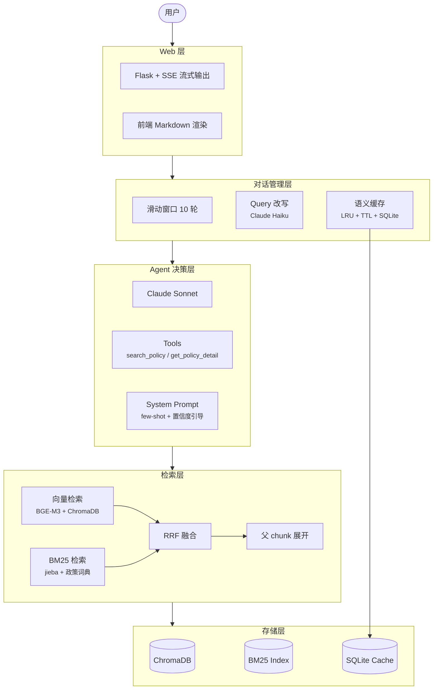
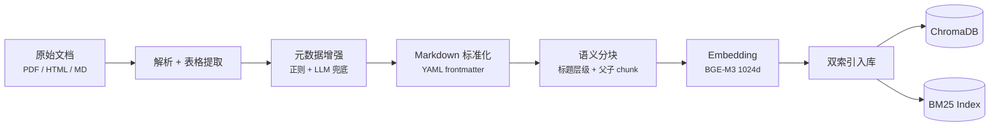
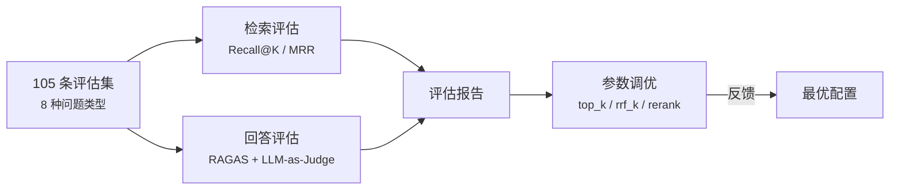

<div align="center">

# 中小企业政策问答 Agent

**基于 RAG + Claude API 的中小企业政策智能问答系统**

[](https://www.python.org/)
[](https://www.anthropic.com/)
[](./LICENSE)
[](#测试)
[](#评估结果)

中文 | **[English](./docs/README_EN.md)**

</div>

---

面向国家中小企业政策信息平台的问答 Agent。用户通过 Web 界面提问，系统自动检索政策文档库，由 Claude 大语言模型综合分析后给出有来源依据的结构化回答。

## 核心特性

| 特性 | 说明 |
|------|------|
| **混合检索** | 向量语义检索（BGE-M3）+ BM25 关键词检索（jieba + 政策词典），RRF 融合 |
| **父子 chunk** | 子 chunk（~300字）检索命中，父 chunk（~1000字）送给 Claude 阅读 |
| **Agent 模式** | Claude 自主决定检索策略、过滤条件、是否追加检索，最多 5 轮 tool_use |
| **SSE 流式输出** | tool_use 阶段静默执行，最终回答逐字流式输出 |
| **多轮对话** | 滑动窗口 10 轮历史 + Haiku Query 改写（指代消解、省略补全） |
| **语义缓存** | Embedding 相似度匹配，LRU + TTL + source 关联失效，SQLite 持久化 |
| **文档处理** | PDF/HTML/Markdown 解析 → 标准化 Markdown + 元数据增强 + 表格 Q&K |
| **评估体系** | 105 条评估集 x 8 种类型，参数调优框架，Recall@7 = 0.97 |

---

## 系统架构

### 在线服务



### 离线处理流水线



### 评估体系



---

## 技术栈

| 组件 | 选型 | 说明 |
|------|------|------|
| LLM | Claude Sonnet (`claude-sonnet-4-6`) | Anthropic SDK，tool_use 多轮调用 |
| LLM 辅助 | Claude Haiku | Query 改写、元数据兜底提取、表格 Q&K 生成 |
| Embedding | BAAI/bge-m3 | 本地模型，1024 维，中文语义检索 |
| 向量数据库 | ChromaDB | 本地持久化，cosine 相似度 |
| 关键词检索 | rank_bm25 + jieba | 自定义政策领域词典（30+ 专有名词） |
| Reranker | BGE-Reranker-v2-m3 | 可选，CrossEncoder 精排 |
| Web 框架 | Flask + SSE | 流式输出，前端 Vanilla JS + marked.js |
| 文档解析 | pdfplumber + markdownify + BeautifulSoup | PDF/HTML/MD 统一解析 |
| 评估 | RAGAS + 自建 LLM-as-Judge | Recall@K、MRR、4 维度评分 |

---

## 快速开始

### 1. 环境准备

```bash
conda create -n ragagent python=3.11 -y
conda activate ragagent
pip install -r requirements.txt
```

### 2. 配置

```bash
cp .env.example .env
# 编辑 .env，填入 ANTHROPIC_API_KEY
```

### 3. 导入数据

将政策文件（PDF / HTML / TXT / Markdown）放入 `data/` 目录：

```bash
# v2 流水线：解析 → 分块 → embedding → 双索引入库
python scripts/ingest_v2.py

# 可选参数
python scripts/ingest_v2.py --no-llm    # 跳过 LLM 兜底（无 API Key 时）
python scripts/ingest_v2.py --clean      # 清空后重新入库
```

### 4. 启动服务

```bash
python src/web/app.py
# 访问 http://localhost:18336
```

---

## 评估结果

### 运行评估

```bash
# 检索评估（v2 混合检索，不调 LLM）
python evaluation/run_eval.py

# v1 纯向量检索对比
python evaluation/run_eval.py --v1

# 完整评估（检索 + RAGAS + LLM-as-Judge）
python evaluation/run_eval.py --full
```

### 参数调优

```bash
python evaluation/tuning.py --param top_k --values 3,5,7,10
python evaluation/tuning.py --param rrf_k --values 20,40,60,80,100
python evaluation/tuning.py --param use_rerank --values true,false
```

### v2.0 评估指标

105 条评估集，覆盖 8 种问题类型、16 篇政策文档：

<table>
<tr>
<td>

| 指标 | v1 纯向量 | **v2 混合检索** |
|------|:---------:|:-------------:|
| Recall@7 | 0.93 | **0.97** |
| MRR | 0.89 | **0.93** |
| 失败数 | 7 | **3** |

</td>
<td>

| 类别 | Recall | 数量 |
|------|:------:|:----:|
| 简单事实 | 1.00 | 52 |
| 多条件 | 1.00 | 8 |
| 跨文档 | 1.00 | 8 |
| 否定问题 | 1.00 | 8 |
| 精确引用 | 1.00 | 6 |
| 时间相关 | 0.86 | 7 |
| 无答案 | 0.86 | 7 |
| 模糊口语 | 0.78 | 9 |

</td>
</tr>
</table>

> 最优参数：`top_k=7, rrf_k=60, rerank=off`

### 调优实验结论

| 参数 | 测试范围 | 最优值 | 结论 |
|------|---------|:------:|------|
| `rrf_k` | 20 - 100 | 60 | 无差异，当前数据规模下两路排名高度一致 |
| `top_k` | 3 - 10 | **7** | 线性提升：3→0.94, 5→0.96, 7→0.97, 10→0.98 |
| `rerank` | on / off | off | +1% Recall 但 11x 慢（64s vs 5.7s），性价比低 |

---

## 测试

```bash
# 全部单元测试（无需外部依赖）
pytest tests/ -m "not integration"

# 集成测试（需要 API Key + 已导入数据）
pytest tests/ -m integration
```

> 当前单元测试：**217 个用例，全部通过**

---

## 项目结构

```
sme-policy-agent/
├── src/
│   ├── ingestion/                  # 文档处理层
│   │   ├── parsers/                #   PDF / HTML / MD 解析器
│   │   ├── metadata/               #   元数据提取（正则 + LLM 兜底）
│   │   ├── table/                  #   表格处理 + Q&K 生成
│   │   ├── cleaner.py              #   格式清洗 + YAML frontmatter
│   │   └── pipeline_v2.py          #   v2 处理流水线
│   │
│   ├── chunking/                   # 分块层
│   │   ├── structure_splitter.py   #   Markdown 标题层级分割
│   │   ├── fixed_splitter.py       #   固定长度兜底分割
│   │   └── parent_child.py         #   父子 chunk 生成
│   │
│   ├── retrieval/                  # 检索层
│   │   ├── embedder.py             #   BGE-M3 Embedding
│   │   ├── vector_store.py         #   ChromaDB 向量索引
│   │   ├── bm25_store.py           #   BM25 关键词索引
│   │   ├── hybrid_searcher.py      #   混合检索 + RRF 融合
│   │   └── reranker.py             #   BGE-Reranker 精排（可选）
│   │
│   ├── conversation/               # 对话管理层
│   │   ├── history.py              #   滑动窗口对话历史
│   │   ├── query_rewriter.py       #   Haiku Query 改写
│   │   └── cache.py                #   语义缓存
│   │
│   ├── agent/                      # Agent 层
│   │   ├── agent.py                #   PolicyAgent (chat / chat_stream)
│   │   ├── tools.py                #   Tool 定义 + 执行
│   │   └── prompts.py              #   System Prompt
│   │
│   └── web/                        # Web 层
│       ├── app.py                  #   Flask + SSE
│       ├── templates/              #   HTML
│       └── static/                 #   CSS + JS
│
├── evaluation/                     # 评估体系
│   ├── dataset/eval_set.json       #   105 条评估数据集
│   ├── retrieval_eval.py           #   Recall@K / MRR
│   ├── answer_eval.py              #   RAGAS + LLM-as-Judge
│   ├── run_eval.py                 #   一键评估
│   ├── tuning.py                   #   参数调优框架
│   └── reports/                    #   评估报告
│
├── scripts/ingest_v2.py            # 数据摄入脚本
├── tests/                          # 217 个单元测试
├── architecture/                   # 架构文档 + 详细设计
├── data/                           # 政策文件 + 解析输出
├── config.py                       # 全局配置
├── requirements.txt                # 依赖
└── CLAUDE.md                       # AI 协作规范
```

---

## 开发历程

| 版本 | 内容 | 代码量 | 测试 |
|:----:|------|:------:|:----:|
| v1.0 | 原型：固定分块 + 纯向量检索 + 非流式输出 | — | 63 |
| **v2.0** | **全面升级：语义分块 + 混合检索 + 流式输出 + 多轮对话 + 评估体系** | **+8000 行** | **217** |

### v2.0 升级记录

| Phase | 内容 | PR |
|:-----:|------|----|
| 1 | 文档处理 + 评估基础（解析器、元数据、表格、评估数据集） | [#1](../../pull/1) |
| 2 | 分块 + 检索升级（语义分块、BM25、混合检索、Reranker） | [#2](../../pull/2) |
| 3 | 对话体验升级（多轮对话、语义缓存、SSE 流式、Prompt 优化） | [#3](../../pull/3) |
| 4 | 模块整合 + 评估调优（v2 摄入、Agent 整合、105 条数据集、参数调优） | [#4](../../pull/4) |

---

## 许可证

本项目基于 [MIT License](./LICENSE) 开源。
