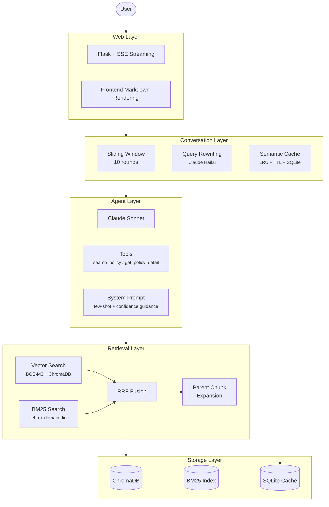
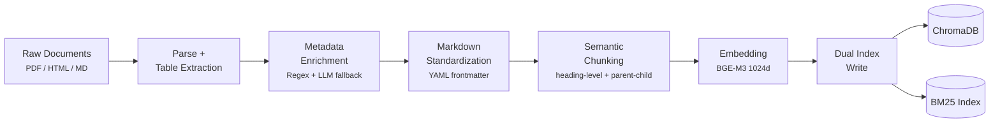
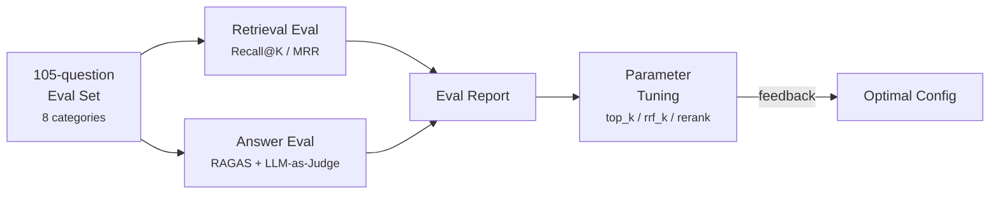

<div align="center">

# SME Policy Q&A Agent

**Intelligent Q&A system for SME policies, powered by RAG + Claude API**

[](https://www.python.org/)
[](https://www.anthropic.com/)
[](../LICENSE)
[](#testing)
[](#evaluation-results)

**[Chinese / 中文](../README.md)** | English

</div>

---

A Q&A Agent built for China's National SME (Small and Medium Enterprise) Policy Information Platform. Users ask questions through a web interface; the system retrieves relevant policy documents and uses Claude to generate structured, source-cited answers.

## Key Features

| Feature | Description |
|---------|-------------|
| **Hybrid Retrieval** | Vector search (BGE-M3) + BM25 keyword search (jieba + domain dictionary), fused with RRF |
| **Parent-Child Chunks** | Child chunks (~300 chars) for retrieval precision, parent chunks (~1000 chars) for Claude context |
| **Agent Mode** | Claude autonomously decides retrieval strategy, filters, and whether to search again (up to 5 tool_use rounds) |
| **SSE Streaming** | Tool calls execute silently; final answer streams token-by-token |
| **Multi-turn Dialogue** | 10-round sliding window history + Haiku-based query rewriting (coreference resolution) |
| **Semantic Cache** | Embedding similarity matching with LRU eviction + TTL expiry + source-based invalidation, persisted in SQLite |
| **Document Processing** | PDF/HTML/Markdown parsing into standardized Markdown + metadata enrichment + table Q&K generation |
| **Evaluation System** | 105-question eval set across 8 categories, parameter tuning framework, Recall@7 = 0.97 |

---

## Architecture

### Online Service



### Offline Ingestion Pipeline



### Evaluation System



---

## Tech Stack

| Component | Choice | Notes |
|-----------|--------|-------|
| LLM | Claude Sonnet (`claude-sonnet-4-6`) | Anthropic SDK with multi-round tool_use |
| LLM Auxiliary | Claude Haiku | Query rewriting, metadata fallback, table Q&K generation |
| Embedding | BAAI/bge-m3 | Local model, 1024d, strong Chinese semantic search |
| Vector DB | ChromaDB | Local persistent storage, cosine similarity |
| Keyword Search | rank_bm25 + jieba | Custom policy domain dictionary (30+ terms) |
| Reranker | BGE-Reranker-v2-m3 | Optional CrossEncoder re-ranking |
| Web Framework | Flask + SSE | Streaming output, Vanilla JS + marked.js frontend |
| Document Parsing | pdfplumber + markdownify + BeautifulSoup | Unified PDF/HTML/MD parsing |
| Evaluation | RAGAS + custom LLM-as-Judge | Recall@K, MRR, 4-dimension scoring |

---

## Quick Start

### 1. Environment Setup

```bash
conda create -n ragagent python=3.11 -y
conda activate ragagent
pip install -r requirements.txt
```

### 2. Configuration

```bash
cp .env.example .env
# Edit .env and add your ANTHROPIC_API_KEY
```

### 3. Data Ingestion

Place policy documents (PDF / HTML / TXT / Markdown) in the `data/` directory:

```bash
# v2 pipeline: parse -> chunk -> embed -> dual-index write
python scripts/ingest_v2.py

# Options
python scripts/ingest_v2.py --no-llm    # Skip LLM fallback (no API key)
python scripts/ingest_v2.py --clean      # Clear and rebuild from scratch
```

### 4. Start Server

```bash
python src/web/app.py
# Visit http://localhost:18336
```

---

## Evaluation Results

### Running Evaluations

```bash
# Retrieval evaluation (v2 hybrid search, no LLM calls)
python evaluation/run_eval.py

# Compare with v1 pure vector search
python evaluation/run_eval.py --v1

# Full evaluation (retrieval + RAGAS + LLM-as-Judge)
python evaluation/run_eval.py --full
```

### Parameter Tuning

```bash
python evaluation/tuning.py --param top_k --values 3,5,7,10
python evaluation/tuning.py --param rrf_k --values 20,40,60,80,100
python evaluation/tuning.py --param use_rerank --values true,false
```

### v2.0 Metrics

105-question eval set covering 8 question types across 16 policy documents:

<table>
<tr>
<td>

| Metric | v1 Vector-only | **v2 Hybrid** |
|--------|:--------------:|:-------------:|
| Recall@7 | 0.93 | **0.97** |
| MRR | 0.89 | **0.93** |
| Failures | 7 | **3** |

</td>
<td>

| Category | Recall | Count |
|----------|:------:|:-----:|
| Simple Fact | 1.00 | 52 |
| Multi-condition | 1.00 | 8 |
| Cross-document | 1.00 | 8 |
| Negation | 1.00 | 8 |
| Exact Citation | 1.00 | 6 |
| Time-related | 0.86 | 7 |
| No Answer | 0.86 | 7 |
| Colloquial | 0.78 | 9 |

</td>
</tr>
</table>

> Optimal parameters: `top_k=7, rrf_k=60, rerank=off`

### Tuning Conclusions

| Parameter | Range | Optimal | Conclusion |
|-----------|-------|:-------:|------------|
| `rrf_k` | 20 - 100 | 60 | No impact at current data scale; both retrieval paths rank consistently |
| `top_k` | 3 - 10 | **7** | Linear improvement: 3->0.94, 5->0.96, 7->0.97, 10->0.98 |
| `rerank` | on / off | off | +1% Recall but 11x slower (64s vs 5.7s); not cost-effective |

---

## Testing

```bash
# Unit tests (no external dependencies required)
pytest tests/ -m "not integration"

# Integration tests (requires API key + ingested data)
pytest tests/ -m integration
```

> Current unit tests: **217 cases, all passing**

---

## Project Structure

```
sme-policy-agent/
├── src/
│   ├── ingestion/                  # Document processing
│   │   ├── parsers/                #   PDF / HTML / MD parsers
│   │   ├── metadata/               #   Metadata extraction (regex + LLM fallback)
│   │   ├── table/                  #   Table processing + Q&K generation
│   │   ├── cleaner.py              #   Format cleaning + YAML frontmatter
│   │   └── pipeline_v2.py          #   v2 processing pipeline
│   │
│   ├── chunking/                   # Chunking layer
│   │   ├── structure_splitter.py   #   Markdown heading-level splitting
│   │   ├── fixed_splitter.py       #   Fixed-length fallback splitting
│   │   └── parent_child.py         #   Parent-child chunk generation
│   │
│   ├── retrieval/                  # Retrieval layer
│   │   ├── embedder.py             #   BGE-M3 embedding
│   │   ├── vector_store.py         #   ChromaDB vector index
│   │   ├── bm25_store.py           #   BM25 keyword index
│   │   ├── hybrid_searcher.py      #   Hybrid search + RRF fusion
│   │   └── reranker.py             #   BGE-Reranker (optional)
│   │
│   ├── conversation/               # Conversation management
│   │   ├── history.py              #   Sliding window history
│   │   ├── query_rewriter.py       #   Haiku query rewriting
│   │   └── cache.py                #   Semantic cache
│   │
│   ├── agent/                      # Agent layer
│   │   ├── agent.py                #   PolicyAgent (chat / chat_stream)
│   │   ├── tools.py                #   Tool definitions + execution
│   │   └── prompts.py              #   System prompt
│   │
│   └── web/                        # Web layer
│       ├── app.py                  #   Flask + SSE
│       ├── templates/              #   HTML
│       └── static/                 #   CSS + JS
│
├── evaluation/                     # Evaluation system
│   ├── dataset/eval_set.json       #   105-question eval set
│   ├── retrieval_eval.py           #   Recall@K / MRR
│   ├── answer_eval.py              #   RAGAS + LLM-as-Judge
│   ├── run_eval.py                 #   One-click evaluation
│   ├── tuning.py                   #   Parameter tuning framework
│   └── reports/                    #   Evaluation reports
│
├── scripts/ingest_v2.py            # Data ingestion script
├── tests/                          # 217 unit tests
├── architecture/                   # Architecture docs + detailed design
├── data/                           # Policy documents + parsed output
├── config.py                       # Global configuration
├── requirements.txt                # Dependencies
└── CLAUDE.md                       # AI collaboration guidelines
```

---

## Development History

| Version | Description | Lines Added | Tests |
|:-------:|-------------|:-----------:|:-----:|
| v1.0 | Prototype: fixed chunking + vector-only search + non-streaming | -- | 63 |
| **v2.0** | **Full upgrade: semantic chunking + hybrid search + streaming + multi-turn + evaluation** | **+8,000** | **217** |

### v2.0 Upgrade Phases

| Phase | Scope | PR |
|:-----:|-------|----|
| 1 | Document processing + evaluation foundation (parsers, metadata, tables, eval set) | [#1](../../pull/1) |
| 2 | Chunking + retrieval upgrade (semantic chunks, BM25, hybrid search, reranker) | [#2](../../pull/2) |
| 3 | Conversation UX (multi-turn, semantic cache, SSE streaming, prompt tuning) | [#3](../../pull/3) |
| 4 | Integration + evaluation tuning (v2 ingest, agent wiring, 105-question set, param sweep) | [#4](../../pull/4) |

---

## License

This project is licensed under the [MIT License](../LICENSE).
